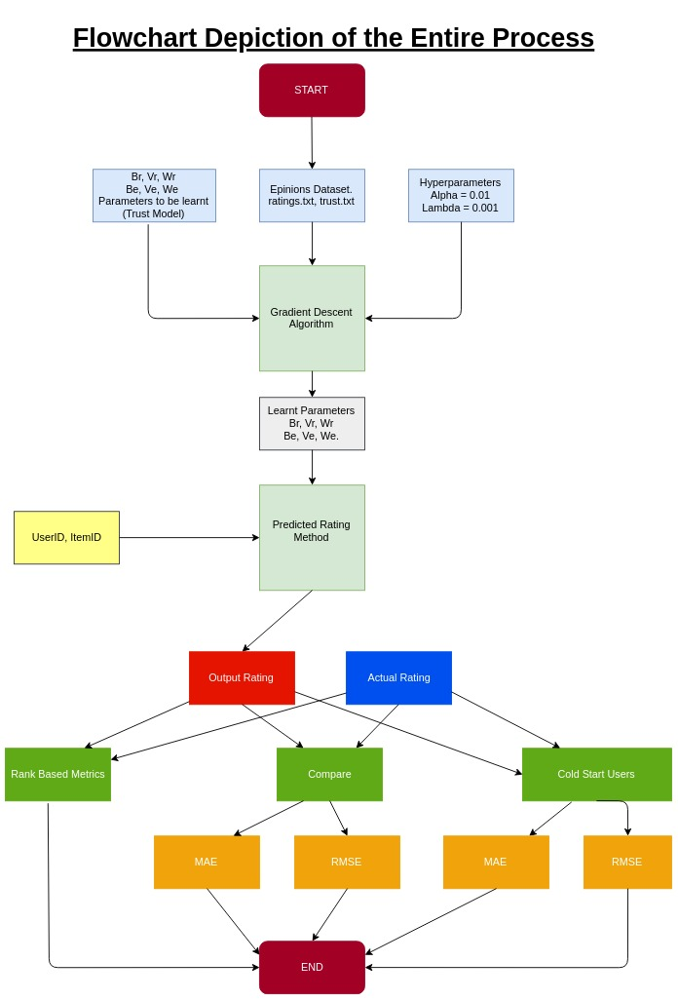

# Implementation of the research paper titled "Social Collaborative Filtering by Trust" in PyTorch using Epinions Dataset.

## Recommender Systems - Collaborative Filtering

This repo contains the implementation of the research paper [Social Collaborative Filtering by Trust](https://www.computer.org/csdl/journal/tp/2017/08/07558226/13rRUwbs1TN) in PyTorch. It was done for the partial fulfillment of the course Informaion Retrieval (CS F469). 

Collaborative Filtering (CF) is a popular technique used by recommender systems. It essentially makes predictions about the preferences of a user by collecting preferences or taste information from many other users (collaboration). CF suffers from a number of problems, the major two among those being:
* Data Sparsity: As users don’t rate all available items, the given ratings dataset is extremely sparse and not a lot can be gleamed from it.
* Cold Start: It is difficult to give accurate recommendations to new users because we don’t have a lot of information on his or her preferences and tastes.

This paper attempts to use the concept of trust to overcome the data sparsity and cold start problem. Trust relationship is one of the most important types of social information, because we are more likely to accept viewpoints from those we trust.

## Epinions Dataset

[Epinions dataset](http://www.trustlet.org/downloaded_epinions.html) is used in this project. It allows users to rate items, browse/write reviews, add friends, and hence provide ratings, reviews and social relations. The trust network in Epinions is directed (i.e. if user A trusts user B, user B may or may not trust user A). Rating values given by users to items range from 1 to 5. The following table shows statistics of Epinions dataset:

| Statistics         | Epinions Dataset |
|--------------------|------------------|
| # Users            |       49289      |
| # Items            |      139738      |
| # Ratings          |      664823      |
| (Density)          |      0.0097%     |
| # Relations        |      487183      |
| (Density)          |      0.0201%     |
| # Ratings per user |       13.49      |
| # Ratings per Item |       4.76       |
| # Friends per user |       9.88       |

The `data` folder contains the Epinions dataset - both ratings data and trust data. The `npy_files` folder contains following four summarising files for Epinions dataset:

1. `nbi.npy`: It is a Numpy array containing number of ratings given by each user.
2. `nvj.npy`: It is a Numpy array containing number of ratings given to each item.
3. `mbi.npy`: It is a Numpy array containing number of users trusted by each user.
4. `mwk.npy`: It is a Numpy array containing number of users who trust each user.

## Terminology used in the Paper

Let there be `M` users and `N` items. Then, let `R` denote a `MxN` user-item rating matrix and `T` denote a `MxM` matrix represnting directional trust relationships among users. 

Let `D` denote dimensionality of latent space used to represent users and items. Then, let `U` and `V` be `DxM` and `DxN` matrices representing user feature matrix and item feature matrix respectively. Hence, the ratings matrix `R` can be approximated as inner product of `U` and `V`. 

Due to asymmetry property of trust, each user is mapped as two distinct `D`-dimensional latent feature vectors, depicted by truster-specific feature vectors `B` and trustee-specific feature vectors `W` (each of `DxM` shape), characterizing the behaviours of "to trust others" and "to be trusted by others" respectively. Hence, the trust matrix `T` can be approximated as inner product of `B` and `W`. 

## Trust Models proposed in the Paper

The research paper describes two trust models:

1. **TrustMF**: It consists of two sub-models - TrusterMF (which approximates user-feature matrix `U` with `B`) and TrusteeMF (which approximates user-feature matrix `U` with `W`). The final rating output for an user and an item is the mean of rating outputs of the two sub-models.

2. **TrustPMF**: It considers the fact that an user's browsing interest (i.e. `B`) or writing interest (i.e. `W`) is not usually strictly identical to his/her genuine interest (i.e. `U`). Consequently, it provides a probabilistic interpretation to the deterministic Truster/Trustee/TrustMF models, and can more accurately infer interest pattern of users.

This repo contains two Jupyter notebooks - one for TrustMF model and the other for TrustPMF model. Each notebook consists of following three parts:

**1**. Read input data i.e. ratings data and trust data.

**2**. Train TrustMF/TrustPMF model.

**3**. Compute following evaluation metrics:
  * Validation on all users using mean absolute error (MAE) and root mean square error (RMSEE) - Paper section `4.3.1`.
  * Validation on cold start users using mean absolute error (MAE) and root mean square error (RMSEE) - Paper section `4.3.2`.
  * Validation on rank-based metrics i.e Precision, Recall and F1-score - Paper section `4.3.4`.

The following flowchart summarises the above points:

